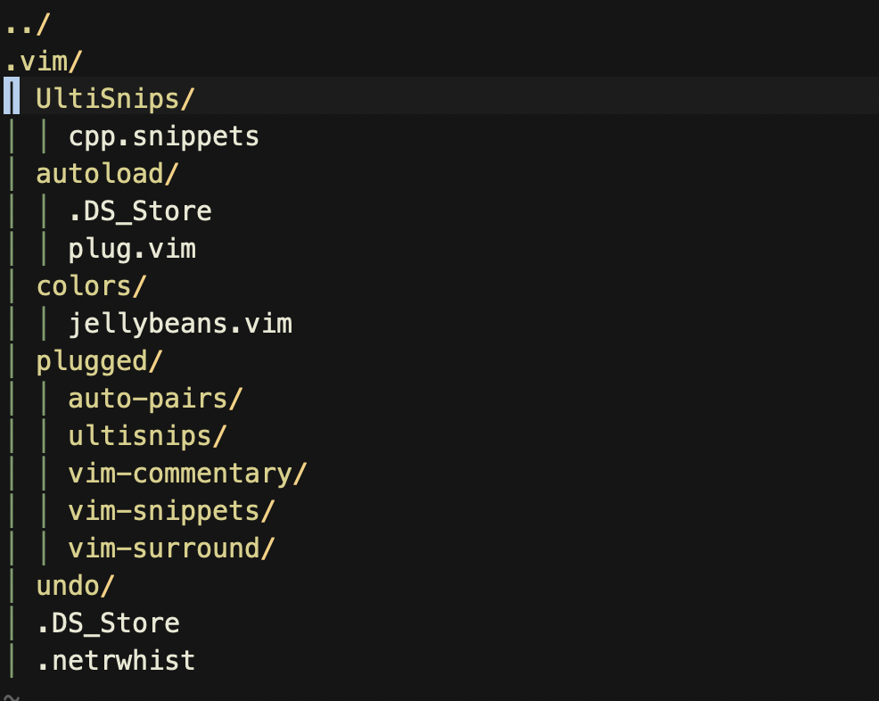

# Vim Config for CP

Vim configuration for competitive programming in C++, using [Vim-Plug](https://github.com/junegunn/vim-plug).

## Requirements

- GCC (via Homebrew on macOS)

This setup uses [`bits/stdc++.h`](https://raw.githubusercontent.com/gcc-mirror/gcc/master/libstdc++-v3/include/precompiled/stdc++.h), which is part of GCC's C++ standard library.

On macOS, the file is typically located at:

```text
/opt/homebrew/Cellar/gcc/<version>/include/c++/<version>/bits/stdc++.h
```

## Installation

1. Copy vimrc to your home directory:

```bash
cp vimrc ~/.vimrc
```

2. Install vim-plug (plugin manager):

```bash
   curl -fLo ~/.vim/autoload/plug.vim --create-dirs \
       https://raw.githubusercontent.com/junegunn/vim-plug/master/plug.vim
```

3. Install plugins:

```bash
vim +PlugInstall +qall
```
(Or run `:PlugInstall` inside Vim)

4. Add custom C++ snippets:

After step 3,`~/.vim` will be created with the plugin structure. Then add your custom snippets:

```bash
mkdir -p ~/.vim/UltiSnips
cp vim/UltiSnips/cpp.snippets ~/.vim/UltiSnips/
```

Your `~/.vim` folder should look like this:

